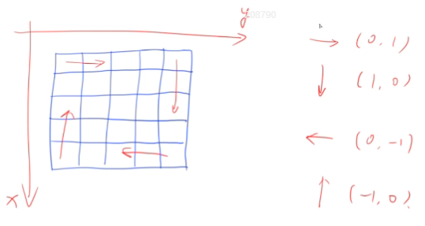
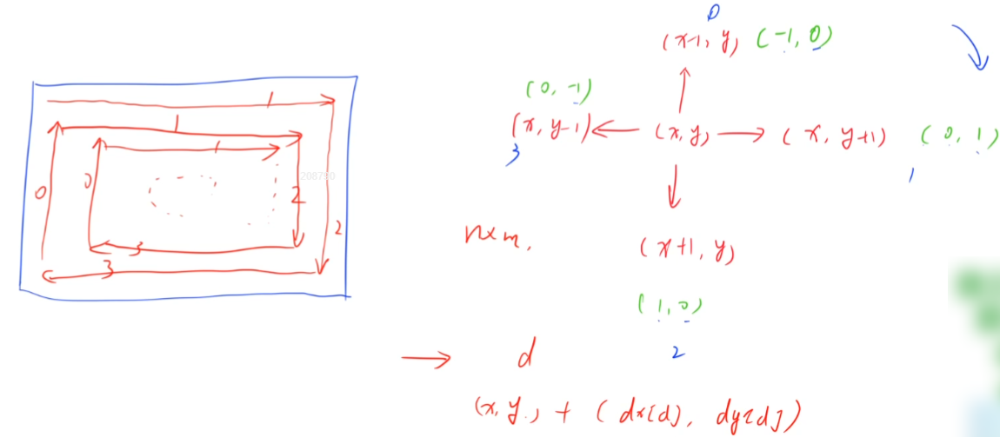
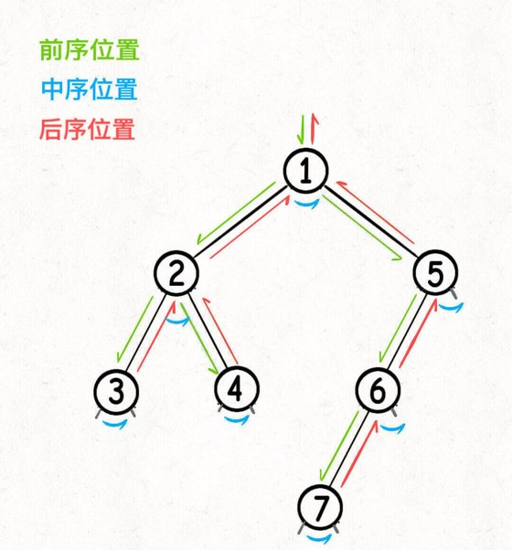
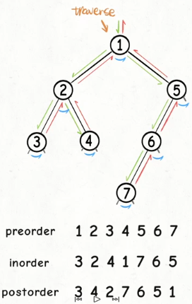
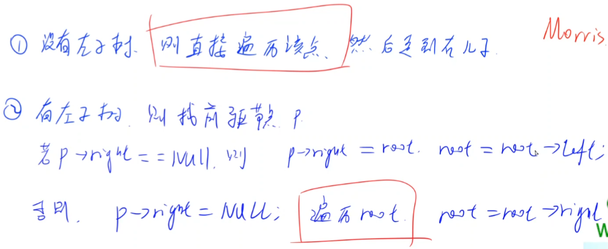
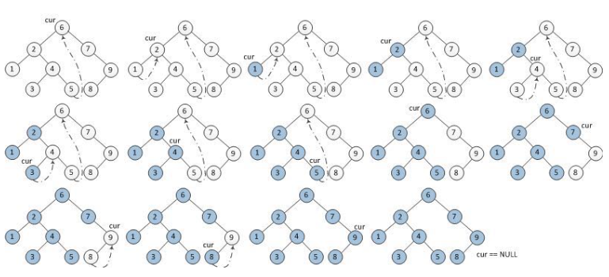
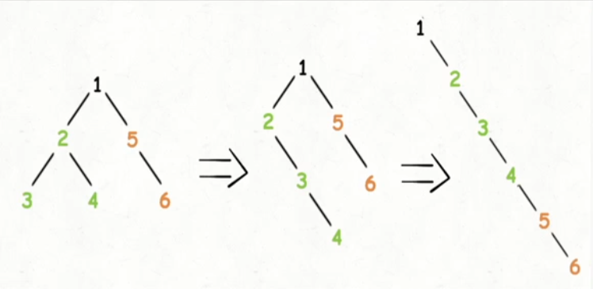
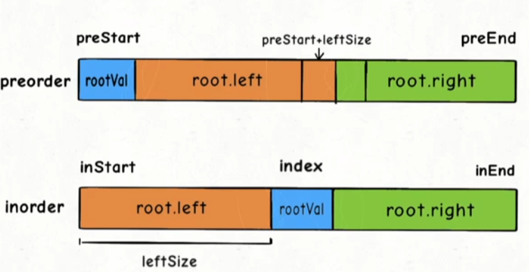

# 其他总结

## 矩阵中的「距离」

### 偏移距离

:rocket:  **[LeetCode 54. 螺旋矩阵](https://leetcode.cn/problems/spiral-matrix/)**

:rocket:  **[LeetCode 59. 螺旋矩阵 II](https://leetcode.cn/problems/spiral-matrix-ii/)**




- 偏移矩阵：`int dx[4] = {0, 1, 0, -1}, dy[4] = {1, 0, -1, 0};`
- 只要按照上述方式定义偏移矩阵，且偏移顺序从0开始(`d = 0`)，就能保证偏移方向依次为左-下-右-上，当前方向不满足条件时，下一个方向就一定是满足条件的，所以只用`if`单次判断就可以，而不需要`while`循环

### 曼哈顿距离

### 边界线距离

### 对角线距离

## 二叉/多叉树

:pushpin: **基本原理**

- **[二叉树理论基础](https://programmercarl.com/%E4%BA%8C%E5%8F%89%E6%A0%91%E7%90%86%E8%AE%BA%E5%9F%BA%E7%A1%80.html)：满二叉树、完全二叉树(Complete Binary Tree, CBT)、二叉搜索/排序树(Binary Search Tree, BST)、二叉线索树(Binary Thread Tree, BTT)、平衡二叉搜索树(Adelson Velsky and Landis, AVL)、红黑树(Red Black Tree, RBT)：自平衡的BST**
- **[东哥带你刷二叉树（纲领篇）](https://labuladong.gitee.io/algo/di-yi-zhan-da78c/shou-ba-sh-66994/dong-ge-da-334dd/)：遍历思想：是否可以通过遍历二叉树的每一个节点得到答案？** 如果可以，用一个`traverse()`函数(具有唯一形参)配合若干个全局变量，函数递归修改全局变量来实现，该递归函数可以有返回值，也可以无返回值；**分治思想：是否可以通过子问题(子树)的答案推导出原问题的答案？** 如果可以，一般直接用LeetCode上的待补全函数作为递归函数，并充分利用函数的返回值，该思路核心在于你要给该函数一个合适的定义(函数的输入是什么？输出是什么？实现何种功能？)，然后用函数的定义来解释每一个节点进行的操作(这是递归的精髓，不要陷入函数具体的执行过程中)；如果逻辑成功自恰，说明这个算法是正确的。
- **这两种思想都要执行函数递归。这两种思想都需要思考：如果单独抽出一个二叉树节点，它需要做什么事情？需要在什么时候(前序/中序/后序)做，其他的节点不用操心，递归函数会在所有节点上执行相同的操作**
- 遍历思想对应深度优先搜索，分治思想对应动态规划，不过后者都变成了N叉树问题，需要用到`for`循环遍历子节点；遍历思想对于特殊情况的判断(空二叉树)包含在递归函数的终止条件中，而分治思想对于特殊情况的判断包含在自身递归终止的条件中
- 二叉/多叉树的左右子树也都是二叉/多叉树，原问题被分解为结构相同但规模较小的子问题，这是分治思想得以实现的理论基础。**分治思想的关键在于已经对左右子树分别执行完给定操作之后，如何将左右子树的结果合并为原问题的结果，** 这是分治思想的核心，也是递归函数的核心，也是动态规划的核心，也是回溯算法的核心
- 对于大部分问题，都可以这两种思想分别解决，因此要尽可能实现一题多解

### 二叉树的深度优先遍历

:pushpin: **基本原理**

- 二叉树的遍历方式可大致分为深度优先遍历与宽度优先遍历，深度优先遍历中根据根节点的遍历位置可分为先序遍历、中序遍历、后序遍历(**均是先遍历左子节点再遍历右子节点**)，宽度优先遍历指的是层序遍历(使用队列的先入先出性质)
- 深度优先遍历做法可以分为两种：递归(遍历函数本身递归)与迭代(用栈手动模拟函数的递归调用过程)，对于大部分算法题，建议使用递归，一定要把递归练透，因为递归是后面很多复杂算法的基础
- 使用栈进行迭代时，将根节点压入栈顶对应递归左子树，在此之前读取根节点的内容对应前序遍历；遍历完左子树后弹出栈顶前读取根节点的内容对应中序遍历；后序遍历顺序为“左右根”，因此使用迭代方法遍历时，可以先按照“根右左”的顺序遍历，最后将结果翻转即可
- **函数遍历的顺序是永远不会改变的，与前中后序位置无关。因此只需要把前中后序遍历理解为三个不同的时间点，在三个不同的时间点上可以进行很复杂的操作来达到目的。把递归函数理解为一个指针，在不同节点上游走，递归函数一次运行结束意味着该指针返回这次操作前的原位置。对一个节点进行操作的前中后序时间点就是在指针刚刚指向该节点/指针在该节点的左右子节点切换/指针将要离开该节点的时间点**

- 另外还有一种Morris遍历方法，这种方法不常用，是在线索二叉树的基础上衍生出来的一种方法
- LeetCode上对于二叉树均是以数组形式输入的，因此正确的理解逻辑是数组中的元素是二叉树按照一定顺序遍历的结果，然后通过补空法即可创建想要的二叉树
- **思想提炼：[东哥带你刷二叉树（纲领篇）](https://labuladong.gitee.io/algo/di-yi-zhan-da78c/shou-ba-sh-66994/dong-ge-da-334dd/)，数组和链表也有迭代与递归两种遍历方式，和二叉树的深度优先遍历统一。前序、中序、后序是遍历二叉树过程中操作每一个节点的三个特殊时间点，绝不仅仅是三个顺序不同的序列**

> 二叉树遍历模板

```C++
/**
 * Definition for a binary tree node.
 * struct TreeNode {
 *     int val;
 *     TreeNode *left;
 *     TreeNode *right;
 *     TreeNode() : val(0), left(NULL), right(NULL) {}
 *     TreeNode(int x) : val(x), left(NULL), right(NULL) {}
 *     TreeNode(int x, TreeNode *left, TreeNode *right) : val(x), left(left), right(right) {}
 * };
 */

/* 递归遍历 */
void traverse(TreeNode* root) {
    // 递归终止条件
    if (root == null) {
        return;
    }
    // 前序位置：自顶向下
    traverse(root->left);
    // 中序位置
    traverse(root->right);
    // 后序位置：自底向上
}

/* 迭代遍历写法一 */
stack<TreeNode*> stk;
// 左侧树枝一撸到底
void pushLeftBranch(TreeNode* p) {
    while (p != null) {
        /* 前序位置 */
        stk.push(p);
        p = p->left;
    }
}
void traverse(TreeNode* root) {
    // 指向上一次遍历完的子树根节点
    TreeNode* visited = new TreeNode(-1);
    // 开始遍历整棵树
    pushLeftBranch(root);
    while (stk.size()) {
        TreeNode* p = stk.top();
        // p的左子树不需要遍历或被遍历完了，但右子树还未被遍历
        if ((p->left == null || p->left == visited) && p->right != visited)
            /* 中序位置 */
            /* 接下来遍历右子树 */
            pushLeftBranch(p->right);
        // p的右子树不需要遍历或被遍历完了
        if (p->right == null || p->right != visited)
            /* 后序位置 */
            /* 以p为根的子树被遍历完了，出栈，指针visited指向p */
            visited = stk.pop();
    }
}
// 利用这个框架可以将任何递归遍历改写为迭代遍历，只需要在遍历过程中将前中后序位置的代码按照遍历顺序放入框架即可

/* 迭代遍历写法二 */
// 前序、中序：对应不同的操作位置
vector<int> res;
stack<TreeNode *> stk;
while (root || stk.size()) {
    while (root) {
        /* 前序位置 */
        stk.push(root);
        root = root->left;
    }
    root = stk.top();
    stk.pop();
    /* 中序位置 */
    root = root->right;
}
return res;

// 后序：根右左，最后再反转
vector<int> res;
stack<TreeNode *> stk;
while (root || stk.size()) {
    while (root) {
        /* 后序位置 */
        stk.push(root);
        root = root->right;
    }
    root = stk.top();
    stk.pop();
    root = root->left;
}
reverse(res.begin(), res.end());
return res;
```

> 数组遍历模板

```C++
/* 递归遍历 */
void traverse(int[] arr, int i) {
    if (i == arr.length) {
        return;
    }
    // 前序位置
    traverse(arr, i + 1);
    // 后序位置
}

/* 正序迭代遍历 */
void traverse(int[] arr) {
    for (int i = 0; i < arr.length; i++) {
        // 正序迭代访问arr[i]
    }
}

/* 逆序迭代遍历 */
void traverse(int[] arr) {
    for (int i = arr.length - 1; i >= 0; i --) {
        // 逆序迭代访问arr[i]
    }
}
```

> 链表遍历模板

```C++
/* 递归遍历单链表 */
void traverse(ListNode* head) {
    if (head == null) {
        return;
    }
    // 前序位置
    traverse(head.next);
    // 后序位置
}

/* 正序迭代遍历单链表 */
void traverse(ListNode* head) {
    for (ListNode p = head; p != null; p = p.next) {

    }
}

/* 倒序迭代遍历双向链表 */
void traverse(ListNode* head) {
    for (ListNode p = head; p != null; p = p.prev) {

    }
}
```

- 前序位置的代码只能从函数参数中获取父节点传递来的数据，而后序位置的代码不仅可以获取参数数据，还可以获取到该节点的子树通过函数返回值传递回来的数据。下述两个问题的根本区别在于：一个节点在第几层，从根节点遍历过来的过程就能顺带记录，用递归函数的参数就能传递下去；而以一个节点为根的整棵子树有多少个节点，需要遍历完子树之后才能数清楚，然后通过递归函数的返回值拿到答案
```C++
// 如果把根节点看做第 1 层，打印每个节点所在的层数
// 二叉树遍历函数
void traverse(TreeNode *root, int level) {
    if (root == null) {
        return;
    }
    // 前序位置
    printf("节点 %s 在第 %d 层", root, level);
    traverse(root->left, level + 1);
    traverse(root->right, level + 1);
}

// 这样调用
traverse(root, 1);
```

```C++
// 打印每个节点的左右子树各有多少节点
// 定义：输入一棵二叉树，返回这棵二叉树的节点总数
int count(TreeNode *root) {
    if (root == null) {
        return 0;
    }
    int leftCount = count(root->left);
    int rightCount = count(root->right);
    // 后序位置
    printf("节点 %s 的左子树有 %d 个节点，右子树有 %d 个节点",
            root, leftCount, rightCount);

    return leftCount + rightCount + 1;
}
```

:rocket:  **[LeetCode 144. 二叉树的前序遍历](https://leetcode.cn/problems/binary-tree-preorder-traversal/)**

:rocket:  **[LeetCode 589. N叉树的前序遍历](https://leetcode.cn/problems/n-ary-tree-preorder-traversal/)**
- 对于每个节点的子节点，使用`for`循环进行遍历

:rocket:  **[LeetCode 94. 二叉树的中序遍历](https://leetcode.cn/problems/binary-tree-inorder-traversal/)**

:rocket:  **[LeetCode 145. 二叉树的后序遍历](https://leetcode.cn/problems/binary-tree-postorder-traversal/)**

:rocket:  **[LeetCode 590. N叉树的后序遍历](https://leetcode.cn/problems/n-ary-tree-postorder-traversal/)**
- 对于每个节点的子节点，使用`for`循环进行遍历

:rocket:  **[LeetCode 99. 恢复二叉搜索树](https://leetcode.cn/problems/recover-binary-search-tree/)**
- 二叉搜索树是有序树。若它的左子树不空，则左子树上所有节点的值均小于它的根节点的值；若它的右子树不空，则右子树上所有节点的值均大于它的根节点的值；同时它的左、右子树也分别为二叉排序树
- 寻找前驱节点与后继节点时最优的遍历方式是**中序遍历**，这就与线索二叉树对应。因此对二叉搜索树的更高级理解是**中序遍历递增树**，这样可以利用线索二叉树的理论寻找前驱节点与后继节点
- 有序数列从小到大排序，但有两个数被交换了位置。共有两种情况：交换的是相邻两个数，例如`1 3 2 4 5 6`，则第一个相邻逆序对，就是被交换的两个数，这里是3和2；交换的是不相邻的数，例如`1 5 3 4 2 6`，则第一个相邻逆序对的第一个数和第二个相邻逆序对的第二个数就是被交换的两个数，这里是5和2
  
> Morris算法：类似于线索二叉树中寻找前驱节点与后继节点


 
1) 参考来源：[题解](https://www.acwing.com/video/1444/)
2) 该算法的时间复杂度是 O(n)，空间复杂度是 O(1)
3) 当前节点有左子树时，其前驱节点是其左子树最右下角的节点(上图中的P)

### 二叉树的宽度优先遍历

:pushpin: **基本原理**

- 利用队列先进先出的特点模拟树的层序遍历

```C++
queue<TreeNode*> q;
if (root) q.push(root);

while (q.size()) { //控制不同树层之间的循环
    vector<int> level;
    int len = q.size();
    // for (int i = 0; i < len; i ++) //这种循环方式可以判断是否到达树层尾部
    while (len -- ) { //控制同一树层之间的循环
        auto t = q.front();
        q.pop(); //一定不要忘记出队列，否则会造成栈溢出
        /* 对每个节点的操作 */
        if (t->left) q.push(t->left);
        if (t->right) q.push(t->right);
    }
}
```
- 层序遍历本质是BFS问题，后文简称层序思想

:rocket:  **[LeetCode 102. 二叉树的层序遍历](https://leetcode.cn/problems/binary-tree-level-order-traversal/)**

:rocket:  **[LeetCode 107. 二叉树的层序遍历 II](https://leetcode.cn/problems/binary-tree-level-order-traversal-ii/)**
- 层序思想：要求自底向上遍历只需利用函数`reverse()`将结果二维`vector`翻转

:rocket:  **[LeetCode 199. 二叉树的右视图](https://leetcode.cn/problems/binary-tree-right-side-view/)**
- 层序思想：在每一层遍历时判断是否到达本层的最后
- 遍历思想：先遍历右子树，再遍历左子树，第一次进入每层时将当前节点的值存入全局变量
```C++
vector<int> res;
int depth = 0;
vector<int> rightSideView(TreeNode* root) {
    traverse(root);
    return res;
}
void traverse(TreeNode *cur) {
    if (!cur) return;
    depth ++;
    if (res.size() < depth) //这个思想很妙
        res.push_back(cur->val);
    traverse(cur->right);
    traverse(cur->left);
    depth --;
}
```

:rocket:  **[LeetCode 515. 在每个树行中找最大值](https://leetcode.cn/problems/find-largest-value-in-each-tree-row/)**
- 层序思想：在每一层遍历时求取最大值

:rocket:  **[LeetCode 1161. 最大层内元素和](https://leetcode.cn/problems/maximum-level-sum-of-a-binary-tree/)**
- 层序思想：在每一层遍历时求取层内元素之和并判断，记录所在层数

:rocket:  **[LeetCode 637. 二叉树的层平均值](https://leetcode.cn/problems/average-of-levels-in-binary-tree/)**
- 层序思想：在每一层遍历时求取平均值

:rocket:  **[LeetCode 116. 填充每个节点的下一个右侧节点指针](https://leetcode.cn/problems/populating-next-right-pointers-in-each-node/)**
- 层序思想：在每一层遍历时操作当前遍历节点的`next`指针
- 遍历思想：将原二叉树中两两需要连接在一起的节点看做是三叉树中的一个新节点，进行三叉树的节点遍历
- 层序 + 模拟：
```C++
if (!root) return root;
auto source = root;
while (root->left) { //每次都从树层的最左边开始遍历
    for (auto p = root; p; p = p->next) {
        // 本树层节点的 next 指针已在上一树层操作过
        p->left->next = p->right;
        if (p->next)
            p->right->next = p->next->left;
    }
    root = root->left;
}
return source;
```

:rocket:  **[LeetCode 117. 填充每个节点的下一个右侧节点指针 II](https://leetcode.cn/problems/populating-next-right-pointers-in-each-node-ii/)**
- 层序思想：和上一题完全一样

:rocket:  **[LeetCode 513. 找树左下角的值](https://leetcode.cn/problems/find-bottom-left-tree-value/)**
- 层序思想：最后一层遍历时的第一个元素就是树左下角的值
- 根据题意要求优化后的层序遍历：树层之间从右边开始遍历
```C++
queue<TreeNode *> q;
if (root) q.push(root);
while (q.size()) {
    int len = q.size();
    vector<int> tmp;
    while (len --) {
        root = q.front();
        q.pop();
        if (root->right) q.push(root->right);
        if (root->left) q.push(root->left);
    }
}
return root->val;
```

:rocket:  **[LeetCode 1302. 层数最深叶子节点的和](https://leetcode.cn/problems/deepest-leaves-sum/)**

:rocket:  **[LeetCode 429. N 叉树的层序遍历](https://leetcode.cn/problems/n-ary-tree-level-order-traversal/)**
- 层序思想：对于树层中的任一节点，遍历其所有所有子节点，将不为空的子节点全部加入队列
- 图论中BFS思想的起源

### 求取二叉树的属性、判断二叉树的性质

:pushpin: **基本原理**

- 求二叉树的深度

```C++
// 写法一：配合全局变量，遍历函数无返回值
int depth = 0;
void traverse(TreeNode *cur) {
    if (!cur) return;
    depth ++;
    traverse(cur->left);
    traverse(cur->right);
    depth --;
}

// 写法二：遍历函数有返回值，但主函数有可能不接收这个返回值，这也是符合语法规则的
int traverse(TreeNode *cur) {
    if (!cur) return 0;
    int left = traverse(cur->left);
    int right = traverse(cur->right);
    // 在后序位置利用左右子树的高度信息判断性质、求取属性
    // 110. 平衡二叉树、543. 二叉树的直径、
    return max(left, right) + 1;
}
```

:rocket:  **[LeetCode 100. 相同的树](https://leetcode.cn/problems/same-tree/)**
- 分治思想：如果左子树与右子树都分别相同，则这两个二叉树相同。对于所给待补全函数，输入两个二叉树的根节点，返回两个二叉树是否相同。对于带判断的每对节点，注意判断节点是否为空

:rocket:  **[LeetCode 101. 对称二叉树](https://leetcode.cn/problems/symmetric-tree/)**
- 分治思想：左子树的右子节点与右子树的左子节点相等，且左子树的左子结点与右子树的右子节点相等。因此可以利用上一题的思路，编写一个判断两个二叉树是否相同的函数，然后在主函数中调用这个函数

:rocket:  **[LeetCode 572. 另一棵树的子树](https://leetcode.cn/problems/subtree-of-another-tree/)**
- 分治思想：需要用到上一题判断两个二叉树是否完全相同的思路

:rocket:  **[LeetCode 1367. 二叉树中的链表](https://leetcode.cn/problems/linked-list-in-binary-tree/)**
- 先考虑链表是否为空，再考虑二叉树是否为空，这样可以减少很多特判

:rocket:  **[LeetCode 104. 二叉树的最大深度](https://leetcode.cn/problems/maximum-depth-of-binary-tree/)**
- 遍历思想：遍历二叉树的每个节点，用外部变量`depth`记录函数`traverse()`所指向的节点的深度，当指向叶节点时`depth`与全局变量`res`取较大值就可以得到目前遍历过程的最大深度。对于每个节点，都需要在前序位置`depth ++;`，而在后序位置`depth --;`
- 分治思想：二叉树的最大深度等于左子树深度与右子树深度取较大值加一(根节点)。对于所给待补全函数，输入二叉树的根节点，输出二叉树的最大深度，因此可对左右子树分别递归调用该函数，最后取较大值加一

:rocket:  **[LeetCode 559. N叉树的最大深度](https://leetcode.cn/problems/maximum-depth-of-n-ary-tree/)**
- 遍历思想：遍历N叉树的每个节点，用一个外部变量记录当前节点所在的深度，当到达叶子节点时与全局变量取较大值就可以得到最大深度

:rocket:  **[LeetCode 543. 二叉树的直径](https://leetcode.cn/problems/diameter-of-binary-tree/)**
- 遍历思想：遍历二叉树的每个节点，节点的直径等于左子树深度与右子树深度之和(可以沿用求最大深度的思路)，最后取最大值就可以得到整个二叉树的直径
- 分治思想：二叉树的直径等于左子树深度与右子树深度之和。在求最大深度的后序位置可以顺便求出以当前节点为根节点的二叉树的直径，最后维护一个全局变量即可

:rocket:  **[LeetCode 111. 二叉树的最小深度](https://leetcode.cn/problems/minimum-depth-of-binary-tree/)**
- 遍历思想：遍历二叉树的每个节点，用外部变量`depth`记录函数`traverse()`所指向的节点的深度，当指向叶节点时`depth`与全局变量`res`取较小值就可以得到目前遍历过程的最小深度。对于每个节点，都需要在前序位置`depth ++;`，而在后序位置`depth --;`
- 分治思想：二叉树的最小深度等于左子树深度与右子树深度取较小值加一(根节点)。注意当其中一棵子树为空时不能取其深度，因为还未到达叶子结点，因此要进行两重特判
- 注意：取较大值时全局变量的初始值设为`0`或`-INT_MAX`，取较大值时全局变量的初始值设为`INT_MAX`，这是和最大深度问题的不同之处
- 层序思想：自顶向下从左到右遍历时，首先遇到的叶子结点处的深度就是最小深度

:rocket:  **[LeetCode 222. 完全二叉树的节点个数](https://leetcode.cn/problems/count-complete-tree-nodes/)**
- 层序思想：层序遍历二叉树，将二叉树的节点存入数组中，最后返回数组长度
- 遍历思想：遍历二叉树的每个节点，在前/中/后序位置每遍历一个节点就将全局变量`res`加一，最后返回`res`
- 分治思想：完全二叉树的节点个数等于左子树节点个数加右子树节点个数加根节点。对于所给待补全函数，输入完全二叉树的根节点，返回完全二叉树的节点个数，因此可对左右子树分别递归调用该函数，最后加一返回

:rocket:  **[LeetCode 110. 平衡二叉树](https://leetcode.cn/problems/balanced-binary-tree/)**
- 遍历思想：遍历二叉树的每个节点，用全局变量`flag`记录是否存在不满足题意的节点，计算该节点的左右子树的高度差，不满足题意要求是置为`false`。进行上述判断时，为了利用其左右子树的高度信息，需要在后序位置进行判断

:rocket:  **[LeetCode 257. 二叉树的所有路径](https://leetcode.cn/problems/binary-tree-paths/)**
- 遍历思想：遍历二叉树的每个节点，在前序位置将节点的值加入路径，在后序位置将节点的值从路径中删除。在前序位置判断是否到达叶子节点。若到达就将当前路径加入全局变量之中，加入之前需要使用`int`向`string`转换的函数：`to_string`

:rocket:  **[LeetCode 404. 左叶子之和](https://leetcode.cn/problems/sum-of-left-leaves/)**
- 遍历思想：遍历二叉树的每个节点，维护全局变量`sum`，判断当前节点的左子结点是否为叶子节点，若是则将其值加入`sum`，否则递归调用该函数。在前序位置判断是否有左子结点，若到达就将当前节点的值加入全局变量`sum`

:rocket:  **[LeetCode 513. 找树左下角的值](https://leetcode.cn/problems/find-bottom-left-tree-value/)**

:rocket:  **[LeetCode 112. 路径总和](https://leetcode.cn/problems/path-sum/)**
- 遍历思想：遍历二叉树的每个节点，用外部变量`sum`记录函数`traverse()`所走过路径上的和，在遍历途中到达叶子节点时判断路径和是否与所给目标和相等。对于每个节点，都需要在前序位置`sum += root->val;`，而在后序位置`sum -= root->val;`
- 在遍历途中，可以进行剪枝优化，即找到一条满足题意的路径可直接返回，不必继续遍历
- 分治思想：在根节点的左右子树中寻找是否存在和为`targetSum - root->val`的路径。对于所给待补全函数，输入二叉树的根节点与目标值，返回二叉树中是否存在路径和等于所给目标值。对于每个节点，当节点为叶节点时，若该节点的值等于目标值，则返回`true`，否则返回`false`

:rocket:  **[LeetCode 113. 路径总和 II](https://leetcode.cn/problems/path-sum-ii/)**
- 遍历思想：与上一题的遍历思想一样，只不过在遍历时不仅需要记录当前走过的路径总和，还需要记录当前走过的路径，在离开节点时也需要维护两个全局变量

:rocket:  **[LeetCode 437. 路径总和 III](https://leetcode.cn/problems/path-sum-iii/)**

:rocket:  **[LeetCode 129. 求根节点到叶节点数字之和](https://leetcode.cn/problems/sum-root-to-leaf-numbers/)**
- 遍历思想：遍历一遍二叉树即可得到答案，判断是否到达叶子结点维护全局变量`sum`即可，在进入/离开节点时维护的全局变量`line`需要一定技巧

:rocket:  **[LeetCode 1022. 从根到叶的二进制数之和](https://leetcode.cn/problems/sum-of-root-to-leaf-binary-numbers/)**
- 遍历思想：遍历一遍二叉树即可得到答案，判断是否到达叶子结点维护全局变量`sum`即可，在进入/离开节点时维护的全局变量`path`需要一定技巧，直接将`root->val`变为十进制加和

:rocket:  **[LeetCode 988. 从叶结点开始的最小字符串](https://leetcode.cn/problems/smallest-string-starting-from-leaf/)**
- 遍历思想：遍历一遍二叉树即可得到答案，判断是否到达叶子节点，维护全局变量`path`时要先翻转`reverse`再与`res`作比较，比完还得再翻转回来，方便下一次记录路径，因为记录路径的过程是自顶向下，但题目要求自底向上

:rocket:  **[LeetCode 662. 二叉树最大宽度](https://leetcode.cn/problems/maximum-width-of-binary-tree/)**

:rocket:  **[LeetCode 1457. 二叉树中的伪回文路径](https://leetcode.cn/problems/pseudo-palindromic-paths-in-a-binary-tree/)**
- 遍历思想：遍历一遍二叉树即可得到答案，判断是否到达叶子节点，用计数数组记录在到达叶子节点前路径上每个数字出现的次数，如果至多有一个数字出现了奇数次，那么该路径中包含回文序列，即该路径是伪回文路径

### 二叉树的修改与构造

:pushpin: **基本原理**

> 二叉树的修改问题一般都要直接把所给待补全函数作为递归函数，然后利用递归函数的返回值

```C++
// 输入一个链表，把 val 插入到链表的尾部，返回结果链表
ListNode *addLast(ListNode *head, int val) {
    if (head == nullptr)
        return new ListNode(val);
    head->next = addLast(head->next, val);
    return head;
}
```

```C++
// 输入一个链表，删除最后一个元素，返回结果链表
ListNode *removeLast(ListNode *head) {
    if (head->next == nullptr)
        return nullptr;
    head->next = removeLast(head->next);
    return head;
}
```

:rocket:  **[LeetCode 226. 翻转二叉树](https://leetcode.cn/problems/invert-binary-tree/)**
- 遍历思想：遍历二叉树的每个节点，在前序或后序位置交换其左右子节点。对于每个节点，在前序或后序位置交换其左右节点
- 分治思想：在左右子树全部交换完成之后，交换根节点的左右子树(后序位置)。对于所给待补全函数，输入二叉树的根节点，返回翻转后的二叉树的根节点

:rocket:  **[LeetCode 971. 翻转二叉树以匹配先序遍历](https://leetcode.cn/problems/flip-binary-tree-to-match-preorder-traversal/)**
- 提交错误

:rocket:  **[LeetCode 114. 二叉树展开为链表](https://leetcode.cn/problems/flatten-binary-tree-to-linked-list/)**
- 分治思想：将左右子树分别展开为链表，然后找到由左子树展开而成的链表的尾节点，将右子树接在该尾节点后面，最后将左子树作为右子树。对于所给待补全函数，输入二叉树的根节点，将该二叉树展开为链表


:rocket:  **[LeetCode 105. 从前序与中序遍历序列构造二叉树](https://leetcode.cn/problems/construct-binary-tree-from-preorder-and-inorder-traversal/)**
- 前序遍历的结果中第一个元素就是根节点的值，然后再在中序遍历的结果确定左右子树的节点



```C++
class Solution {
private:
    unordered_map<int, int> valToIndex;
public:
    TreeNode* buildTree(vector<int>& preorder, vector<int>& inorder) {
        for (int i = 0; i < inorder.size(); i ++)
            valToIndex[inorder[i]] = i;
        return build(preorder, 0, preorder.size() - 1, inorder, 0, inorder.size() - 1);
    }
    TreeNode* build(vector<int>& preorder, int preStart, int preEnd,
                    vector<int>& inorder, int inStart, int inEnd) {
        if (preStart > preEnd) return nullptr;
        int rootVal = preorder[preStart];
        int index = valToIndex[rootVal];
        int leftSize = index - inStart;
        TreeNode *root = new TreeNode(rootVal);
        root->left = build(preorder, preStart + 1, preStart + leftSize,
                            inorder, inStart, index - 1);
        root->right = build(preorder, preStart + leftSize + 1, preEnd,
                            inorder, index + 1, inEnd);
        return root;
    }
};
```

:rocket:  **[LeetCode 106. 从中序与后序遍历序列构造二叉树](https://leetcode.cn/problems/construct-binary-tree-from-inorder-and-postorder-traversal/)**
- 后序遍历的结果中最后一个就是根节点的值，然后再根据中序遍历结果确定左右子树部分，最后递归构造左右子树即可

```C++
class Solution {
public:
    unordered_map<int, int> valToIndex;
    TreeNode* buildTree(vector<int>& inorder, vector<int>& postorder) {
        for (int i = 0; i < inorder.size(); i ++)
            valToIndex[inorder[i]] = i;
        return build(inorder, 0, inorder.size() - 1, postorder, 0, postorder.size() - 1);
    }
    TreeNode* build(vector<int>& inorder, int inStart, int inEnd, 
            vector<int>& postorder, int postStart, int postEnd) {
        if (postStart > postEnd) return nullptr;
        int rootVal = postorder[postEnd];
        int index = valToIndex[rootVal];
        int leftSize = index - inStart;
        TreeNode* root = new TreeNode(rootVal);
        root->left = build(inorder, inStart, index - 1, postorder, postStart, postStart + leftSize - 1);
        root->right = build(inorder, index + 1, inEnd, postorder, postStart + leftSize, postEnd - 1);
        return root;
    }
};
```

:rocket:  **[LeetCode 889. 根据前序和后序遍历构造二叉树](https://leetcode.cn/problems/construct-binary-tree-from-preorder-and-postorder-traversal/)**
- 首先把前序遍历的结果中第一个元素或者后序遍历的结果中最后一个元素确定为根节点的值
- 然后把前序遍历结果的第二个元素作为左子树的根节点的值
- 在后序遍历结果中寻找左子树根节点的值，从而确定了左子树的索引边界，进而确定右子树的索引边界，递归构造左右子树即可

:rocket:  **[LeetCode 654. 最大二叉树](https://leetcode.cn/problems/maximum-binary-tree/)**
- 分治思想：在给定数组的起始区间中寻找区间内的最大值作为根结点的值，然后递归创建其左右子树即可

:rocket:  **[LeetCode 1325. 删除给定值的叶子节点](https://leetcode.cn/problems/delete-leaves-with-a-given-value/)**
- 遍历思想：遍历二叉树的每个节点，如果该节点的左右子节点都是叶子节点且值为给定值，那么删除该节点的左右子节点，然后判断该节点是否变成了叶子节点，如果是则删除该节点。对于所给待补全函数，输入二叉树的根节点和给定值，返回删除给定值的叶子节点后的二叉树的根节点
- 关键在于只有当节点的左右子节点全部被遍历过之后，这个节点才知道自己会不会变成叶子节点，只有这样才能达到题目中“重复此过程直到不能继续删除”的要求，所以要利用左右子节点的信息必须在后序位置进行是否删除的判断。有时候即使对节点的操作完全一样，但操作的时机不一样，达到的效果也完全不一样

```C++
TreeNode* removeLeafNodes(TreeNode* root, int target) {
    if (root == nullptr) return root;
    root->left = removeLeafNodes(root->left, target);
    root->right = removeLeafNodes(root->right, target);
    if (!root->left && !root->right && root->val == target)
        return nullptr;
    return root;
}
```

:rocket:  **[LeetCode 617. 合并二叉树](https://leetcode.cn/problems/merge-two-binary-trees/)**
- 遍历思想：遍历二叉树的每个节点，直接利用待补全函数的返回值

:rocket:  **[LeetCode 623. 在二叉树中增加一行](https://leetcode.cn/problems/add-one-row-to-tree/)**
- 遍历思想：遍历一遍二叉树即可得到答案，判断是否到达目标深度的上一层即可

:rocket:  **[LeetCode 297. 二叉树的序列化与反序列化](https://leetcode.cn/problems/serialize-and-deserialize-binary-tree/)**
- 暂未解决，视频讲解在4.2二叉树的构造例题解析末尾部分

### 求取二叉搜索树的属性

:pushpin: **基本原理**

```C++
void BST(TreeNode* root, int target) {
    if (root->val == target)
        // 找到目标，做点什么
    if (root->val < target) 
        BST(root->right, target);
    if (root->val > target)
        BST(root->left, target);
}
```

:rocket:  **[LeetCode 700. 二叉搜索树中的搜索](https://leetcode.cn/problems/search-in-a-binary-search-tree/)**
- 当给定节点不存在时，返回比该节点小且最大的节点(`floorKey`)
```C++
class Solution {
public:
    TreeNode* insertIntoBST(TreeNode* root, int val) {
        if (root == NULL) 
            return new TreeNode(val);
        else if (root->val > val) {
            return insertIntoBST(root->left, val);
        }    
        else {
            TreeNode* p = insertIntoBST(root->right, val);
            if (p == NULL) return root;
            return p;
        }
        return root;
    }
};
```
- 当给定节点不存在时，返回比该节点大且最小的节点(`ceilingKey`)
```C++
class Solution {
public:
    TreeNode* insertIntoBST(TreeNode* root, int val) {
        if (root == NULL) 
            return new TreeNode(val);
        else if (root->val > val) {
            TreeNode* p = insertIntoBST(root->left, val);
            if (p == NULL) return root;
            return p;
        }    
        else root->right =  insertIntoBST(root->right, val);
        return root;
    }
};
```

:rocket:  **[LeetCode 98. 验证二叉搜索树](https://leetcode.cn/problems/validate-binary-search-tree/)**
- 对于每一个节点`root`，不能简单比较当前节点的左右子节点的值是否满足条件，因为根据 BST 的定义`root`的整个左子树都要小于`root->val`，整个右子树都要大于`root->val`，这种情况下左右子节点的子节点就有可能不满足，见下图
- 
- 题目所给的节点数值的范围有可能取到`INT_MAX`，所以传递最大最小节点(一开始为空)进行判断，而不能传递节点数值

:rocket:  **[LeetCode 530. 二叉搜索树的最小绝对差](https://leetcode.cn/problems/minimum-absolute-difference-in-bst/)**

:rocket:  **[LeetCode 501. 二叉搜索树中的众数](https://leetcode.cn/problems/find-mode-in-binary-search-tree/)**

:rocket:  **[LeetCode 538. 把二叉搜索树转换为累加树](https://leetcode.cn/problems/convert-bst-to-greater-tree/)**
- 利用二叉搜索树的中序遍历递增的特性，在中序遍历位置累加求和并赋值给当前节点即可

:rocket:  **[LeetCode 938. 二叉搜索树的范围和](https://leetcode.cn/problems/range-sum-of-bst/)**
- 遍历和分治都能做

:rocket:  **[LeetCode 230. 二叉搜索树中第K小的元素](https://leetcode.cn/problems/kth-smallest-element-in-a-bst/)**
- 利用二叉搜索树的中序遍历递增的特性，记录当前节点的位次，判断到与给定位次相等时即可返回

### 二叉树的公共祖先问题

:rocket:  **[LeetCode 235. 二叉搜索树的最近公共祖先](https://leetcode.cn/problems/lowest-common-ancestor-of-a-binary-search-tree/)**

:rocket:  **[LeetCode 236. 二叉树的最近公共祖先](https://leetcode.cn/problems/lowest-common-ancestor-of-a-binary-tree/)**

### 二叉搜索树的修改与构造

:rocket:  **[LeetCode 701. 二叉搜索树中的插入操作](https://leetcode.cn/problems/insert-into-a-binary-search-tree/)**

:rocket:  **[LeetCode 450. 删除二叉搜索树中的节点](https://leetcode.cn/problems/delete-node-in-a-bst/)**

:rocket:  **[LeetCode 669. 修剪二叉搜索树](https://leetcode.cn/problems/trim-a-binary-search-tree/)**

:rocket:  **[LeetCode 108. 将有序数组转换为二叉搜索树](https://leetcode.cn/problems/convert-sorted-array-to-binary-search-tree/)**

:rocket:  **[LeetCode 1008. 前序遍历构造二叉搜索树](https://leetcode.cn/problems/construct-binary-search-tree-from-preorder-traversal/)**
- 通过二叉搜索树的性质确定左右子树的分界点

## 字符串

## 模拟

:rocket:  **[LeetCode 941. 有效的山脉数组](https://leetcode.cn/problems/valid-mountain-array/)**

## 打表

## 刷题常用库函数

- 以程序举例说明

## 栈

### 队列

### 字符串

### 动态数组

### 双端队列

### 优先队列